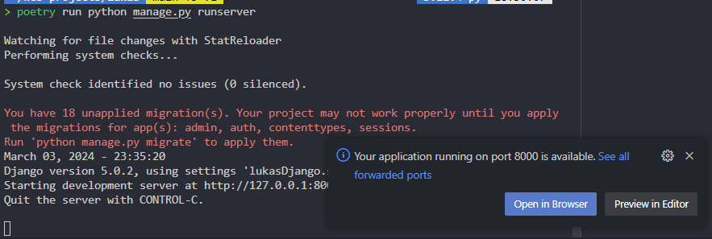

Sources

Inital Django Set up
https://www.youtube.com/watch?v=DaxcmbWcdTA

https://builtwithdjango.com/blog/basic-django-setup

https://testdriven.io/blog/dockerizing-django-with-postgres-gunicorn-and-nginx/

The first step in building a Phyton project s to create a virtual environement 

https://builtwithdjango.com/blog/basic-django-setup

This guide will help you through the process of installing poetry to manage python version in your system and to install python packages. Preferably, use Ubuntu WSL2 
this will alow you to more easily reporduce the environement and evitate conglicts.

You will first need to install pyen using pip.

Prerequisites

Pyenv
We are going to use brew to install Pyenv. If you don't have brew installed on your Mac, run the following command:

'''bash
/bin/bash -c "$(curl -fsSL https://raw.githubusercontent.com/Homebrew/install/HEAD/install.sh)"
'''

Then, install Pyenv:

'''bash
brew update
brew install pyenv
'''
to test if this was installed correctly try running this in your terminal:

'''bash
pyenv --version
'''

we are going to be using Python version 3.11.4 in our tutorial, so let's get that installed with the following command:

'''bash
pyenv install 3.9.9
'''
Your terminal will start giving you some outputs. Wait for a minute or two until the download and installation are complete. This is everything we are going to cover regarding pyenv, we don't need to know more for the purposes of this tutorial.

Poetry
If you have Poetry installed you can skip this step.

So, let's first install Poetry. You can do that by running the following command in your terminal:

'''bash
curl -sSL https://raw.githubusercontent.com/python-poetry/poetry/master/get-poetry.py | python -
'''

The good news is that you have to do it once. To test that everything went smoothly, try running the following in your terminal:

'''bash
poetry --version
'''

Setting up the Environment
Alright, we are now ready to start. Here is what you want to do:

Open up your Ubuntu terminal, cd into the directory that you use to store all your code. For me it is:

cd ~/web

Then create a new directory for your project. I'm going to call mine "core":

mkdir core && cd webscrapper

THen

code .

This will open up your VS Code in the current directory.

The most important part is to set the Python version for your project. You can do that by running the following command:

'''bash
pyenv local 3.11.4
'''
You can verify your local and global python isntalled verisons with the following commands:

'''bash 
pyenv versions
pyenv global
pyenv local
'''

Now, you can create a new virtual environment for your project by running the following command:

'''bash
poetry new .
'''

You should see a file named .python-version created in your folder. That's good.

Now were are going to initialize Poetry project with:
poetry new .
or
poetry init
for and existing project

This will create a new directory with the name of your project and a few files inside. The most important one is pyproject.toml. This is where you will define your project's dependencies.

Now let's add the Django dependency and try running the test server. So, to add a dependency in a Poetry project you just simply do:

'''bash
poetry add Django
'''

'''bash
poetry run django-admin.py startproject basic_django .
'''

Note: in Ubuntu, i runned the comand poetry run django-admin startproject core . insteadf of poetry run django-admin.py startproject basic_django .

This will create a new Django project in your current directory. You can now run the test server by running the following command:

'''bash
poetry run python manage.py runserver
'''
If successful, you should see the following output:

'''bash
Watching for file changes with StatReloader
Performing system checks...

To add a new package to your project, you can use the following command:

'''bash
poetry add <package-name>
'''
or install to install packages in your toml file

Ok, if you have never used poetry before this is important. In the command above can see I'm using poetry run. I'm adding this so that poetry runs the django-admin command for me from the virtual environment that will have all the dependencies that we specified earlier. If you don't want to keep typing poetry run for every command, you can simply run:
poetry shell
and then use commands as you usually would. However, I don't recommend that, since if you have multiple projects open, virtual environments might not work nicely with each other. I suggest explicitly running python commands with poetry run ….

Second thing to note is the "." at the end of the command. This tells us that we have a parent directory already created, no need to do that for us.

Now in your File Explorer you should have the following:

basic_django/ (This will be different for you)
manage.py      
poetry.lock    
pyproject.toml
Finally to test that everything is set up as it should be let's run the local server:
poetry run python manage.py runserver

Adding Static Pages
Before we create models, databases, and other fun stuff let's first create some static pages. For that, we are going to create a "pages" application. I got this approach from Will Vincent, and have been using it for a long time.

Create a new application with the following command:
poetry run python manage.py startapp pages
You should see a new folder pop up in your Code Editor named "pages" 👍.

Head over to the urls.py file in the basic_django directory (remember for you the name of the "core" directory is different, whatever you chose when setting up the project) and add the following:
# basic_django/urls.py
from django.contrib import admin
from django.urls import path, include # new

urlpatterns = [
    path('admin/', admin.site.urls),
    path("", include("pages.urls")), # new
]
What we are doing here is we are adding a namespace to our site, basically saying that all the pages that will be created under the pages app will be at the root of the URL.

Head over to the setting.py in the root folder (basic_django for me) and search for the TEMPLATES variable and replace the DIRS list to be this:
# basic_django/settings.py
...
TEMPLATES = [
    {
        'BACKEND': 'django.template.backends.django.DjangoTemplates',
        'DIRS': [str(BASE_DIR.joinpath('templates'))], # new
        'APP_DIRS': True,
        'OPTIONS': {
            'context_processors': [
                'django.template.context_processors.debug',
                'django.template.context_processors.request',
                'django.contrib.auth.context_processors.auth',
                'django.contrib.messages.context_processors.messages',
            ],
        },
    },
]
...
This will tell our Django application that all templates are under the templates folder.

Now, let's actually create the templates directory in the root folder. You can do that in the VS Code UI, or with the mkdir command. Just make sure that you are in the root folder.
Inside the templates folder create a base.html file. Inside that html file add the following:
<!DOCTYPE html>
<html lang="en">
<head>
  <meta charset="UTF-8">
  <meta http-equiv="X-UA-Compatible" content="IE=edge">
  <meta name="viewport" content="width=device-width, initial-scale=1.0">
  <title>Basic Django Project</title>
</head>
<body>

  
  

</body>
</html>
This template will be used as a base for all other templates in our project. Here, we can add the header, footer, and other components that will be present on each page of the site.

Now, let's create a template for the home page. Create a pages folder, under templates folder. And inside that folder create a home.html file and add the following to it:



  <h1>Helllloooooo!</h1>

Here were are extending the base template and adding a header to it.

Tip: If you are doing this for the first time, this might seem like a hard, long, and annoying task. But once you get the hang of it, things become to make sense and fall into their places.

Now the last two pieces to finish the proper setup of our Django project are URLs and Views.

Let's start with views. Go to the views.py file under the pages folder and add the following code:
# pages/views.py
from django.views.generic import TemplateView

class HomeView(TemplateView):
    template_name = "pages/home.html"
And let's create a URL for that HomeView. Create a urls.py in the pages folder and add the following:
# pages/urls.py
from django.urls import path

from .views import HomeView

urlpatterns = [
    path("", HomeView.as_view(), name="home"),
]
Now if you start the dev server with:
poetry run python manage.py runserver
you should see the word "Helllllooooo!".

Conclusion
Congratulations! You are done with the Django Project Setup. After all of this you should have a directory looking something like this:

.
├── basic_django
│   ├── __init__.py
│   ├── __pycache__
│   │   ├── __init__.cpython-39.pyc
│   │   ├── settings.cpython-39.pyc
│   │   ├── urls.cpython-39.pyc
│   │   └── wsgi.cpython-39.pyc
│   ├── asgi.py
│   ├── settings.py
│   ├── urls.py
│   └── wsgi.py
├── db.sqlite3
├── manage.py
├── pages
│   ├── __init__.py
│   ├── __pycache__
│   │   ├── __init__.cpython-39.pyc
│   │   ├── urls.cpython-39.pyc
│   │   └── views.cpython-39.pyc
│   ├── admin.py
│   ├── apps.py
│   ├── migrations
│   │   └── __init__.py
│   ├── models.py
│   ├── tests.py
│   ├── urls.py
│   └── views.py
├── poetry.lock
├── pyproject.toml
└── templates
    ├── base.html
    └── pages
        └── home.html
After finishing this tutorial you should know how to set up a Django Project with Poetry and Pyenv.

The most used commnads:

poetry run python manage.py runserver

The urls.py file in the core is where you add routes

to add a new app we can use

python manage.py startapp <app-name>

to run it in our case we use

poetry run python manage.py startapp <app-name>

you then need to add it to settings.py in the installed apps list

    '.<app-name>.apps.<app-name>Config'

Now this project knows about this app

URL routng

normally all of our routes are going to be handled by views.py file inside webscrapper app

Go to urls.py in core and 

> poetry run python manage.py makemigrations

> poetry run python manage.py migrate

> poetry run python manage.py createsuperuser